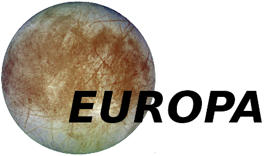

# A library of modern FORTRAN modules.   
Starting in 1979 a set of basic fortran helper functions was started with FORTRAN IV.
In 1982 the library was extended with PDP-11/34 FORTRAN 77.
From 1989-1991 the library was again extended with VAX and Cray FORTRAN.
The next major evolution occured in 1993 with Sun Sparc 20.
From 1996-2000 The library was again extended.
In 2015 a major evolution occured with the complete rewrite in FORTRAN 2003.
Finally, at the end of 2019 the library is being brought up to full 2018 compliance,
with all deprecated features removed. This is a work in progress (60% migrated)
